# YellowSpark

_Authors: Maxime Lovino, Marco Rodrigues Lopes, David Wittwer_

YellowSpark is a project for a Big Data Analytics class at HES-SO Master. The project is based on NYC 2013 Taxi data that can be found [here](http://www.andresmh.com/nyctaxitrips/). The goal of the project is to compute analytics and train machine learning models on the taxi rides in the dataset. The project will be written in Scala and will use Spark to compute the analytics.

We will also use boundaries for the NYC boroughs available [here](https://nycdatastables.s3.amazonaws.com/2013-08-19T18:15:35.172Z/nyc-borough-boundaries-polygon.geojson) as GeoJSON data.

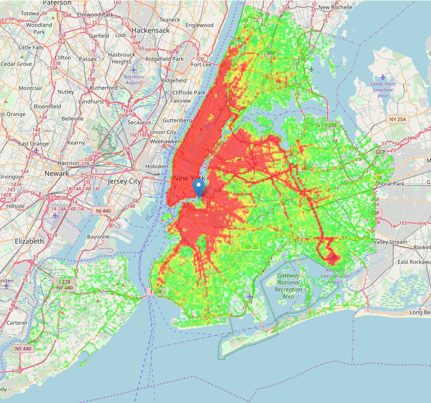

## Downloading the data

You can download all the necessary data using `wget`.

```sh
wget https://nycdatastables.s3.amazonaws.com/2013-08-19T18:15:35.172Z/nyc-borough-boundaries-polygon.geojson
wget https://archive.org/download/nycTaxiTripData2013/trip_data.7z
wget https://archive.org/download/nycTaxiTripData2013/trip_fare.7z
```

Then you can extract the `.7z` files to get the 12 files contained in each of them.

## Dataset description

The dataset consists of New York City taxi rides data from the year 2013. It is separated by month. For each month, two files are available: the `trip_data` and the `trip_fare`. The two files contains the exact same rides but not the same set of columns. There are duplicated columns between the files that will use to join them. An explanation of the story behind the retrieval of this dataset can be found [here](https://chriswhong.com/open-data/foil_nyc_taxi/).

The `trip_data` file has the following structure and contains the information about the taxi physical movement, time and distance:

```
root
 |-- medallion: string (nullable = true)
 |-- hack_license: string (nullable = true)
 |-- rate_code: integer (nullable = true)
 |-- store_and_fwd_flag: string (nullable = true)
 |-- pickup_datetime: timestamp (nullable = true)
 |-- dropoff_datetime: timestamp (nullable = true)
 |-- passenger_count: integer (nullable = true)
 |-- trip_time_in_secs: integer (nullable = true)
 |-- trip_distance: double (nullable = true)
 |-- pickup_longitude: double (nullable = true)
 |-- pickup_latitude: double (nullable = true)
 |-- dropoff_longitude: double (nullable = true)
 |-- dropoff_latitude: double (nullable = true)
```

The `trip_fare` contains information about the cost and payment of the ride and has the following structure:

```
root
 |-- medallion: string (nullable = true)
 |-- hack_license: string (nullable = true)
 |-- vendor_id: string (nullable = true)
 |-- pickup_datetime: timestamp (nullable = true)
 |-- payment_type: string (nullable = true)
 |-- fare_amount: double (nullable = true)
 |-- surcharge: double (nullable = true)
 |-- mta_tax: double (nullable = true)
 |-- tip_amount: double (nullable = true)
 |-- tolls_amount: double (nullable = true)
 |-- total_amount: double (nullable = true)
```

In order to join the two datasets, we use the `medallion`, which is the identifier of the taxi car, the `hack_license` which identifies the driver license and the `pickup_datetime`.

The joined dataset has the following structure:

```
root
 |-- medallion: string (nullable = true)
 |-- hack_license: string (nullable = true)
 |-- pickup_datetime: timestamp (nullable = true)
 |-- rate_code: integer (nullable = true)
 |-- store_and_fwd_flag: string (nullable = true)
 |-- dropoff_datetime: timestamp (nullable = true)
 |-- passenger_count: integer (nullable = true)
 |-- trip_time_in_secs: integer (nullable = true)
 |-- trip_distance: double (nullable = true)
 |-- pickup_longitude: double (nullable = true)
 |-- pickup_latitude: double (nullable = true)
 |-- dropoff_longitude: double (nullable = true)
 |-- dropoff_latitude: double (nullable = true)
 |-- vendor_id: string (nullable = true)
 |-- payment_type: string (nullable = true)
 |-- fare_amount: double (nullable = true)
 |-- surcharge: double (nullable = true)
 |-- mta_tax: double (nullable = true)
 |-- tip_amount: double (nullable = true)
 |-- tolls_amount: double (nullable = true)
 |-- total_amount: double (nullable = true)
```

At first, in order to avoid overloading our computers while still exploring and analysing the dataset, we have only worked on the January data and haven't opened the other files.

The January dataset contains 14'776'615 total rides before any cleaning or filtering, and weighs 2.46GB for the `trip_data` and 1.68GB for the `trip_fare`. 

We then uploaded the 24 files in a AWS S3 bucket in order to run the processing on the whole year on AWS EC2. The total size of the whole uncompressed dataset was more or less 50GB.

## Features used and pre-processing

We added some calculated features to our dataset as well. First of all, we don't like ["retard units"](https://en.wikipedia.org/wiki/Imperial_units) so we added a `trip_distance_km` column to have the distance converted to kilometers. Then, we added the `average_speed_kmh` computed from `trip_time_in_secs` and `trip_distance_km`. The speed will used for one of our analysis as well as for filtering out bad data.

Then, we used the boroughs boundaries we had at our disposal and the pickup/dropoff longitude/latitude of the dataset to add `pickup_borough` and `dropoff_borough`. These two columns will also be used for filtering out bad data and one of our analysis. This is done using ESRI Geometry and is extracted from the project PDF.

Finally, for the fares part, we added `taxi_revenue` which is the sum of the fare and the tip for a ride and as such it computes the amount that goes in the driver's pocket for the ride.

Finally, we also added the `great_circle_distance_km` column that contains the [distance of the straight path](https://en.wikipedia.org/wiki/Great-circle_distance) between the pickup and dropoff locations. This will be used for filtering out bad data.

The final structure is the following:

```
root
 |-- medallion: string (nullable = true)
 |-- hack_license: string (nullable = true)
 |-- pickup_datetime: timestamp (nullable = true)
 |-- rate_code: integer (nullable = true)
 |-- store_and_fwd_flag: string (nullable = true)
 |-- dropoff_datetime: timestamp (nullable = true)
 |-- passenger_count: integer (nullable = true)
 |-- trip_time_in_secs: integer (nullable = true)
 |-- trip_distance: double (nullable = true)
 |-- pickup_longitude: double (nullable = true)
 |-- pickup_latitude: double (nullable = true)
 |-- dropoff_longitude: double (nullable = true)
 |-- dropoff_latitude: double (nullable = true)
 |-- trip_distance_km: double (nullable = true)
 |-- average_speed_kmh: double (nullable = true)
 |-- pickup_borough: string (nullable = true)
 |-- dropoff_borough: string (nullable = true)
 |-- great_circle_distance_km: double (nullable = true)
 |-- vendor_id: string (nullable = true)
 |-- payment_type: string (nullable = true)
 |-- fare_amount: double (nullable = true)
 |-- surcharge: double (nullable = true)
 |-- mta_tax: double (nullable = true)
 |-- tip_amount: double (nullable = true)
 |-- tolls_amount: double (nullable = true)
 |-- total_amount: double (nullable = true)
 |-- taxi_revenue: double (nullable = true)
```

### Data cleaning

First of all, we decided to drop any ride using the rate code #05, because as stated [here](https://www1.nyc.gov/site/tlc/passengers/taxi-fare.page) and as seen in our dataset, the rides with rate code #05 are _Out of City Negotiated Flat Rate_ and in the dataset do not contain any information about duration, distance or locations, so we can't do anything with these rides.

Then, we noticed many "failed" rides with duration smaller or equal to 1 second, distance of 0.0 km, etc. We used the average speed we computed to filter out any ride with an average speed of more than 120 km/h (we could actually go further down with this limit).

There were also some failed coordinates for rides and we decided to remove them as well, basically we used the pickup and dropoff boroughs and filtered out all rides which had started or ended outside of any borough boundaries.

We also removed any rides with 0 passengers and rides with `fare_amount <= 0` because they make no sense.

We noticed that there were rides taking more than 1 day to complete (more than you would think) and also rides where the car was just waiting for almost all day thus having a very low average speed. We decided to remove rides with a speed below 1 km/h and rides taking more than 24 hours to complete.

Finally, we used the `great_circle_distance_km` column we computed to remove all rate code #01 rides (most of the rides have rate code #01 and our trafic congestion model uses only those rides) to remove any  ride that had a distance smaller than the `great_circle_distance_km` with a margin of 0.5 km.

In the end, our full year dataset with the data cleaning applied contains 165'163'063 rides. The final cleaned dataset is saved as Parquet on S3 to be later used by our other programs (more on that later).

We should actually spend even more time thinking about data cleaning, as there are a lot of strange rides in the dataset, but it would require a lot of time to filter out those rides as it needs manual oversight and research for these behaviors.

## Analysis questions

### Data analysis

All our data analysis is done with our `YellowSparkAnalysis` program. This program will run all the analysis listed below and save the results as Parquet dataframes on S3. These dataframes are later opened in Jupyter Notebook with PySpark in order to plot the visualisations. We could have used Zeppelin to plot the visualisations but we find it very incomplete and the plots are only interactive which causes a problem when we restart the notebook kernels because we need to reselect the columns of the plots.

#### Rate codes analysis

As introduced before, the [NYC taxi fare system](https://www1.nyc.gov/site/tlc/passengers/taxi-fare.page) has a number of rate codes to denote the type of ride and the calculation of its fare. The most notables are:

- **Rate code 1**: Standard City Rate (most rides)
- **Rate code 2**: Trips between Manhattan and JFK airport
- **Rate code 3**: Trips between Manhattan and Newark airport

In the plot below, we display the plot of the number of rides per rate code, we used a logarithmic scale for the Y axis because mos trips are in rate code 1 and the other rate codes would be invisible with a linear scale.

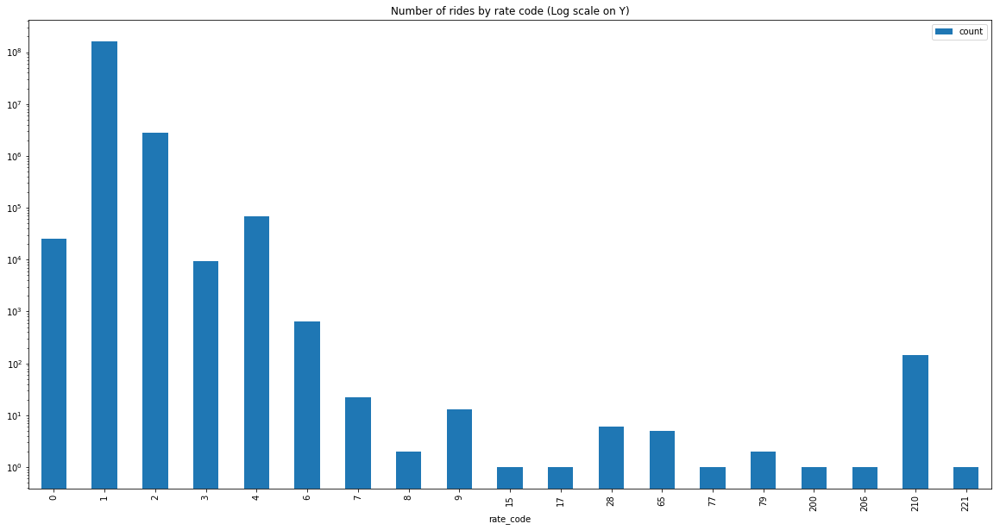

The number of rides is the following:

| rate_code | count     |
| --------- | --------- |
| 0         | 25118     |
| 1         | 162261262 |
| 2         | 2798053   |
| 3         | 9389      |
| 4         | 68387     |
| 6         | 654       |
| 7         | 22        |
| 8         | 2         |
| 9         | 13        |
| 15        | 1         |
| 17        | 1         |
| 28        | 6         |
| 65        | 5         |
| 77        | 1         |
| 79        | 2         |
| 200       | 1         |
| 206       | 1         |
| 210       | 144       |
| 221       | 1         |

#### Boroughs analysis by pairs of boroughs

##### Number of rides

In the maps below, we can see the number of rides **for the whole year** between pairs of boroughs, we noticed that the majority of the rides are inside Manhattan, or eventually only departing from Manhattan (airports are outside Manhattan). Staten Island is the most remote borough and as such it contains the least amount of rides.

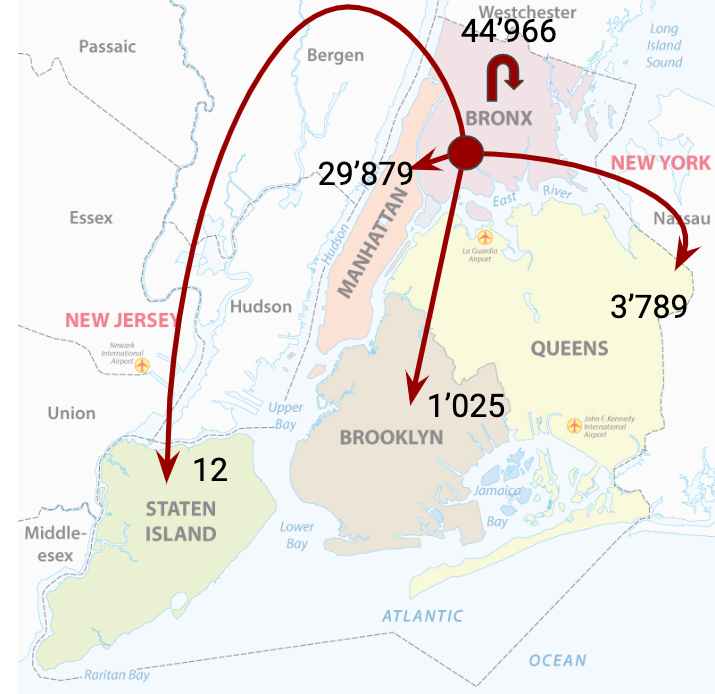
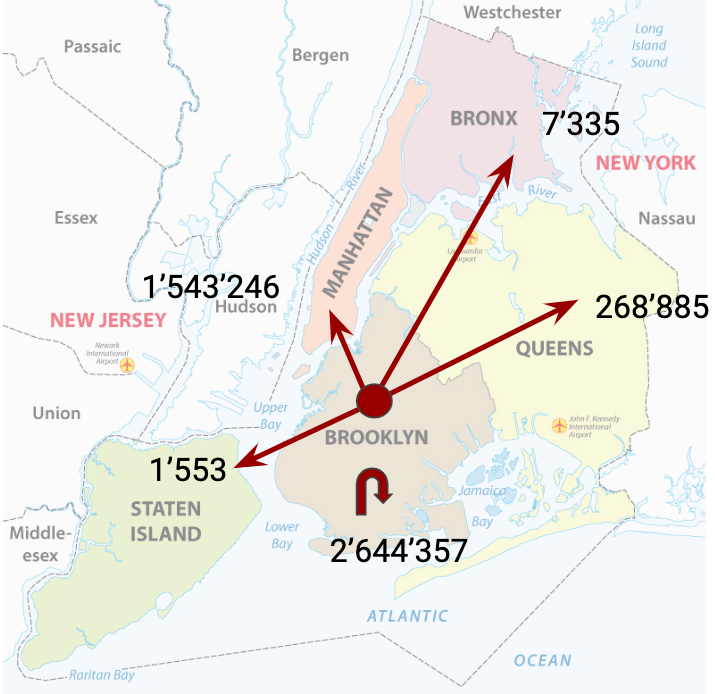
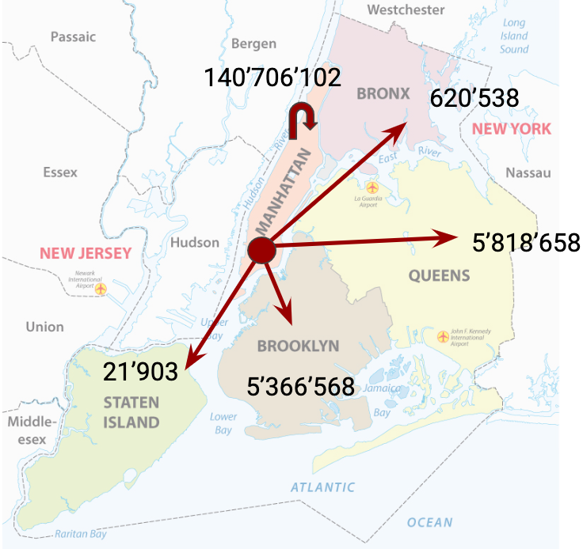
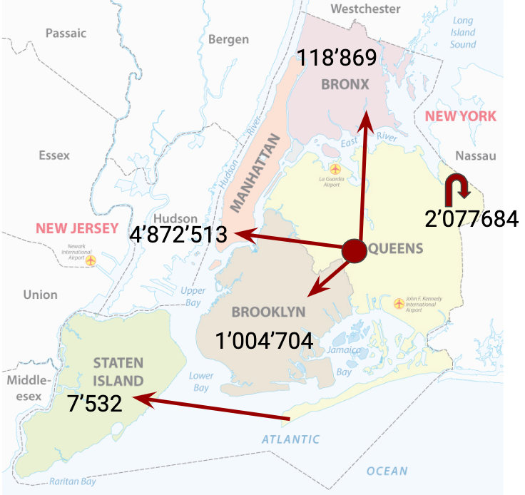
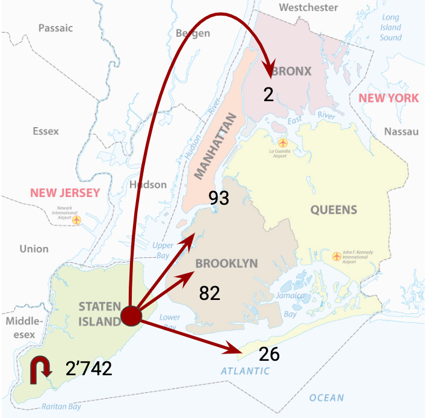

##### Average tip

Above, we see that Staten Island has the least rides because it's really far from the rest, but they got the back of their drivers by providing the most tips on average to compensate for the long ride. This can also be a factor of the price of the ride. In general, trips starting in Bronx amount to the smallest average tips, this may be correlated to the the fact that people are in general poorer in the Bronx.

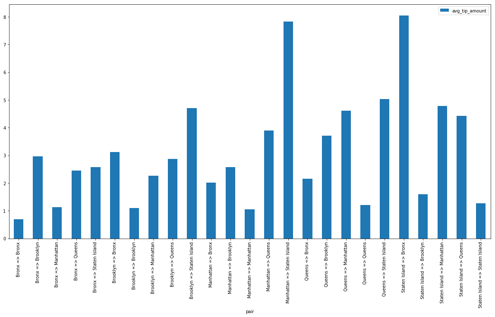

##### Wait times by last borough

We sessionised the rides of every taxi driver in order to find the wait time between two rides. By computing the averages and displaying them, we can have an idea of where drivers should wait to find a new ride. We see that if you end in Manhattan, you will find a new ride in less that 10 minutes more or less. The worst borough to end in is Staten Island, as it will take more or less 50 minutes to find a new ride, because it will often involve going back to Manhattan before finding one.

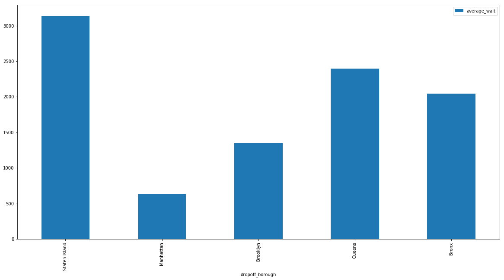

#### Dates and time analysis

##### Number of rides

By displaying the number of rides per day of year, we notice a repeating pattern, with an increase over perhaps a week and then it goes back then at the end of that. We can also see that we have way less rides in an area a bit after the middle of the year. We will dive into this with the next graphs.

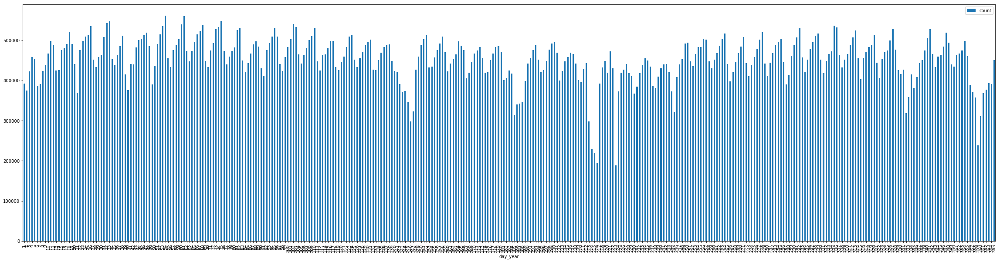

By looking at the number of rides per month, we see a reflection of the dip in rides, it is located in August. We see a general trend of taking less rides in the summer months.

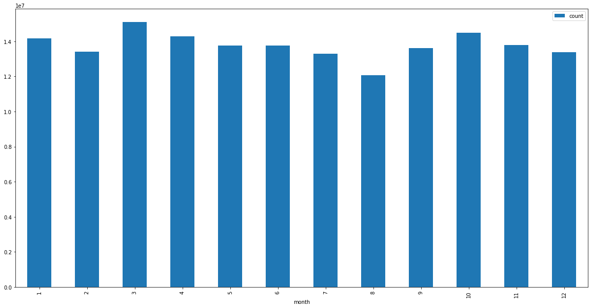

As far as the week trend we noticed earlier, it is reflected in the number of rides per week day, we see an increase in the number of rides on Friday and Saturday (6 and 7), so the trend is over a week but with weeks starting on Sunday.

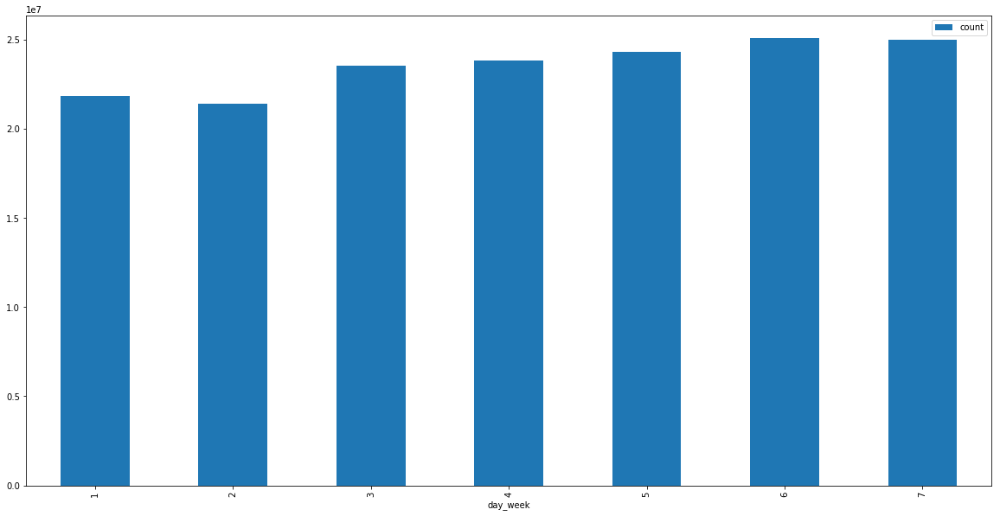

Finally, we can look at the number of rides by hour of the day. People tend to take a cab more in the evening to go out and "less" during the day, we can see that of course during the day it decrease but there are still more or less 2'000'000 rides taking place around 5am during the year. NYC is the city that never sleeps.

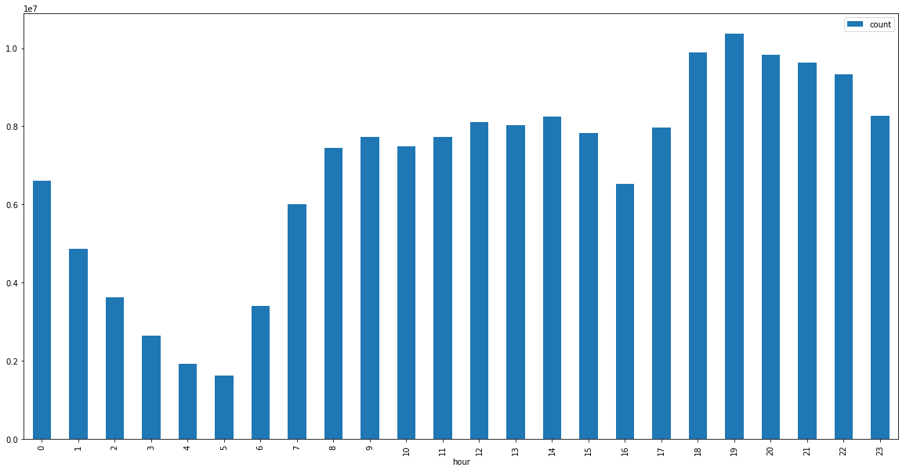

##### Average tip amount

But hopefully the drivers for these 5am rides will be rewarded with generous tips? Well yes…at least people taking cabs during the night show their gratitude to the drivers.

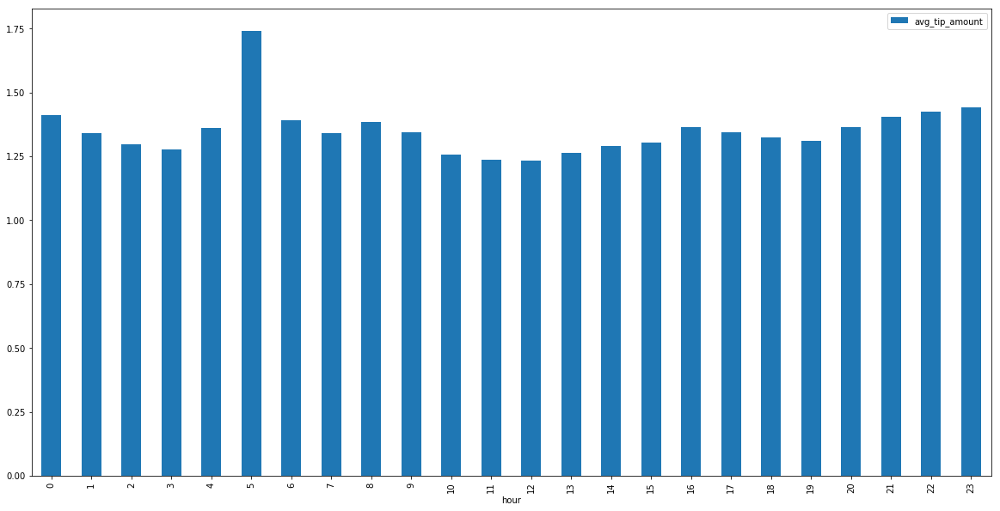

#### Top drivers

We found 42528 unique drivers in the dataset (unique hack licenses), in this section we will look at the evolution of the 100 best drivers in different metrics.

##### Most revenue

We notice a slowing decrease in the revenue per driver in the top 100. The top driver in terms of revenue has accumulated 230'000 $ in one year.

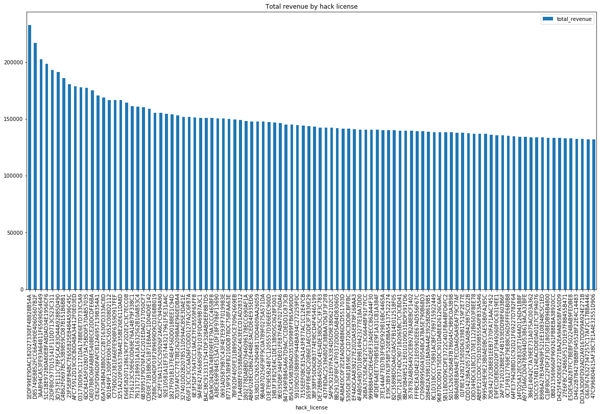

##### Most distance

We notice a less slowing decrease in the distance per drivers in the top 100. The top driver in terms of distance has driven for 77'000 km in one year.


##### Most trip duration

Here, the top driver in terms of time spent on rides has spent the equivalent of 136 days on rides, that is 9 hours per day on rides on average.

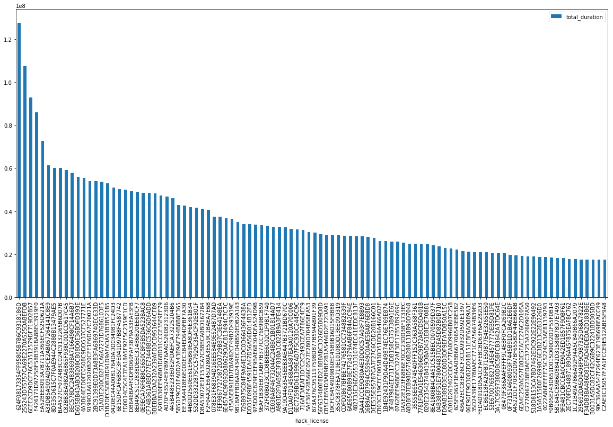

##### Most time efficiency

Now, when looking at time efficiency we can find some strange things. The top driver here is making more or less 2.50 $ **PER SECOND** spent on rides. That's a nice job but how is that even possible? He may only paid to wait on very expensive rate codes.

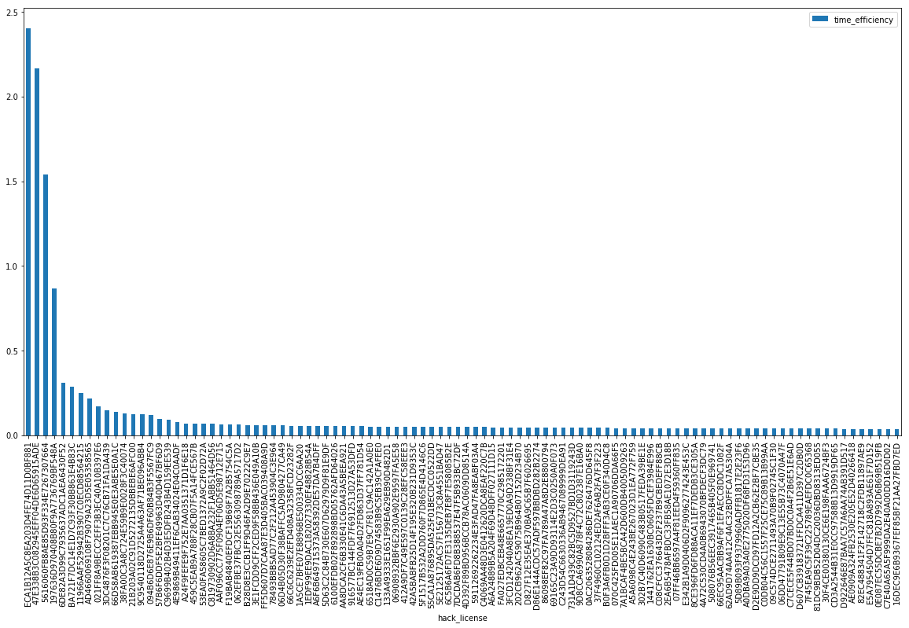

##### Most distance efficiency

Same thing here, the most efficient driver in terms of distance is making 250 $ **PER KM**. Again, he may be on special rate codes?

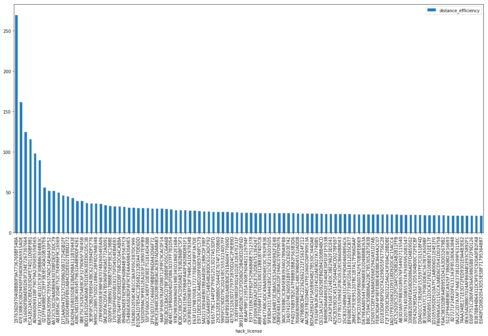

#### Distances analysis

Finally, we look at the number of rides for each distance value, on the x axis we have the floor of the kilometer distance for the ride. The y axis uses a logarithmic scale, we see a steady logaritmic decrease more or less in the number of rides as the distance increases. Rides above 100 km may be bad data that we should filter but we can't say for sure.

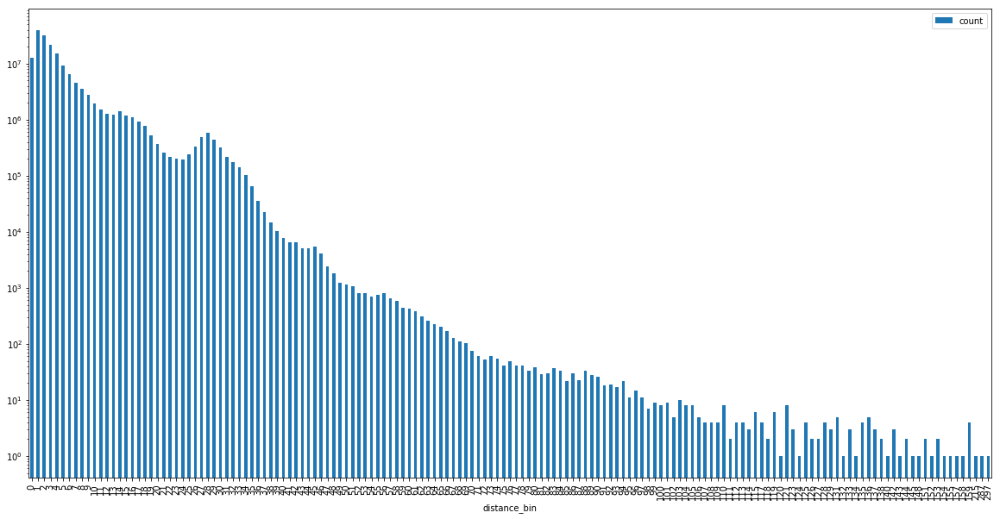

### Machine Learning

#### Linear regression model for fare calculation

We trained a linear regression for the 4 main rate codes in order to estimate the formula used to compute fares. To do this, we took the full dataset, filtered for the rate code and then split into training and test sets. The features we used to train were the distance and the duration of the trip and we wanted to predict the fare amount.

We can see that for rate codes 1 and 2 we have respectable Mean Squared Errors values. In the case of rate code, this means that we can predict the cost with +/- 1.30 \$. For rate code 2, currently, it is a fixed rate of 52 \$. We can notice a similarity with the 50.818 we found as the base fare.

| Rate Code | MSE (Mean Squared Error) | Formula                                  |
| --------- | ------------------------ | ---------------------------------------- |
| 1         | 1.804926                 | 0.006 * seconds  + 1.201   * km + 2.095  |
| 2         | 4.070359                 | 0.000 * seconds  + 0.039   * km + 50.818 |
| 3         | 56.277111                | 0.003 * seconds  + 1.371   * km + 20.203 |
| 4         | 16.970909                | 0.004 * seconds  + 1.642   * km + 2.047  |

For rate code 1, even though we have the best MSE, we notice on the plot that we have a lot of difference for certain rides, most of the rides are grouped at the bottom left, and the rides with big difference are actually very strange rides and perhaps should be filtered, we should remove any data deviating from the norm as the rate code normally has a fixed fare formula:

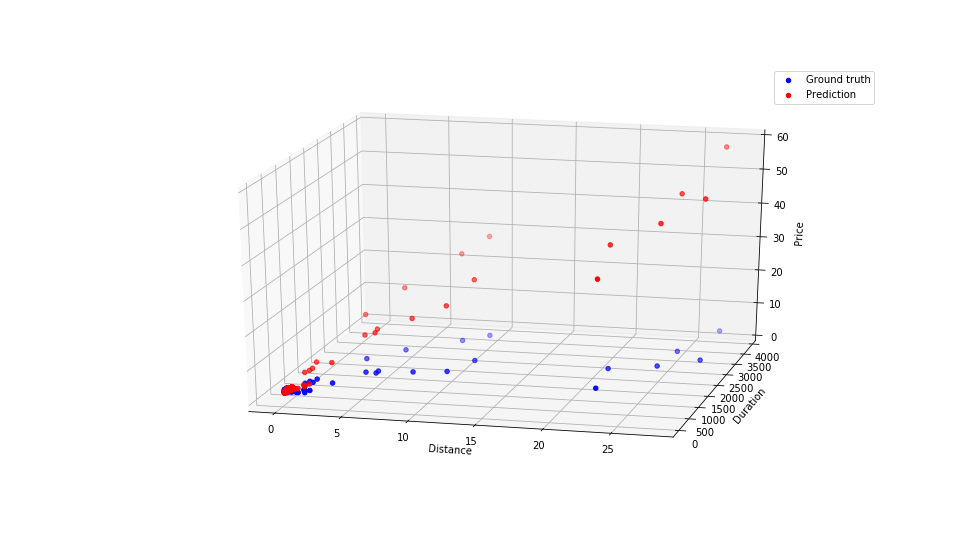

We can look at the plots for rate code 2 to see that it matches well here:

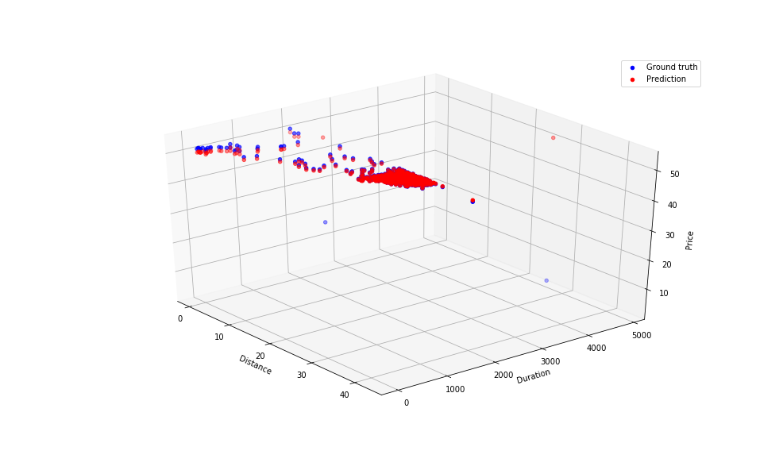

And for rate code 3 to see that it matches well again:

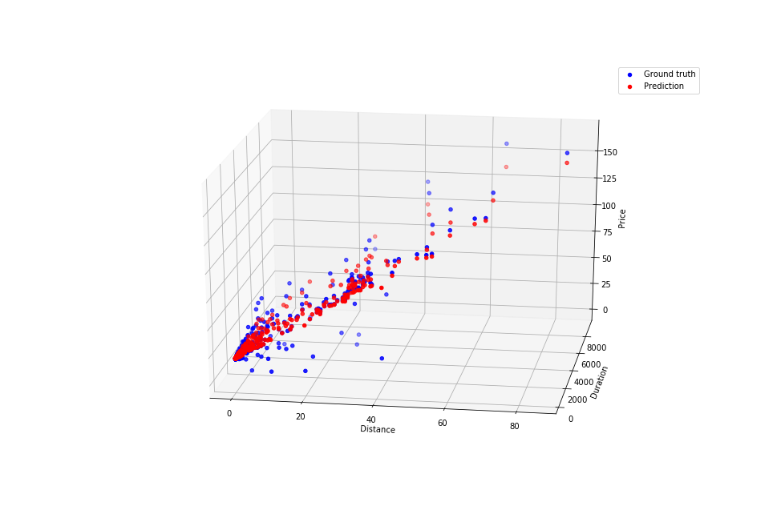

#### Regression model for trip duration prediction

We also trained a model to estimate traffic congestion, the goal here is to estimate the duration of a trip before it happens. We decided to train this model only for Manhattan and only for rate codes 1 rides.

The features used are:

- The pickup date time as hour of the week (sinus and cosinus, see below)
- The pickup coordinates
- The dropoff coordinates (destination requested by the user)
- The distance (could be estimated by the taxi driver using Google Maps for example)

We built a [Gradient Boost Regression](https://spark.apache.org/docs/latest/ml-classification-regression.html#gradient-boosted-tree-regression) model for this as noticed that it was the best model in practice. In the end (after 5 hours of training on 16 cores), we had an estimation accurate to +/- 4 minutes for the trip duration. This is not enough to be useful in our opinion but the [trip duration estimation problem is a very interesting problem](https://www.kaggle.com/c/nyc-taxi-trip-duration/overview) and we should take more time on it if we want to solve it.

##### Feature extraction

We extracted the hour of the week as a feature, so that we have hours from midnight on Sunday (hour 0) to the next Saturday at 11pm (hour 168). This allows to have a proximity in the data when stepping over the midnight mark each day. We wanted to use weekly traffic patterns so we limited it to 1 week.

The problem is the drop at the end of the week to go back to 0 for the start of next week, but the hours are still close to them in practice and we lose this proximity here.

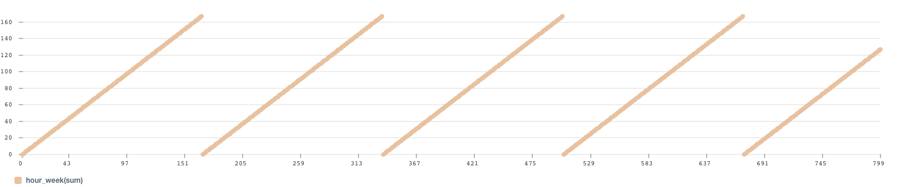

In order to combat this, we computed the sinus and cosinus with the following formulas:

```scala
df
.withColumn("sin_pickup_hour_week", sin((lit(2 * Math.PI) * $"pickup_week_hour") / pickupMaxHour))
.withColumn("cos_pickup_hour_week", cos((lit(2 * Math.PI) * $"pickup_week_hour") / pickupMaxHour))
```

While we could one or the other to get a continuous signal, we need the combination of the two otherwise we have repetitions of the same values for two different hours if we take only one of the two.

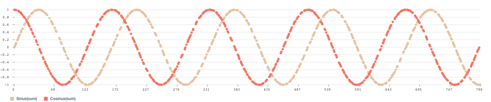

## Optimisations with Parquet

TODO talk about using Parquet

## Future improvements

TODO talk about better models and data for traffic prediction, multiyear data as well