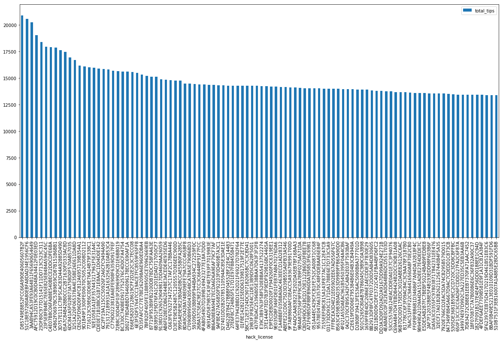
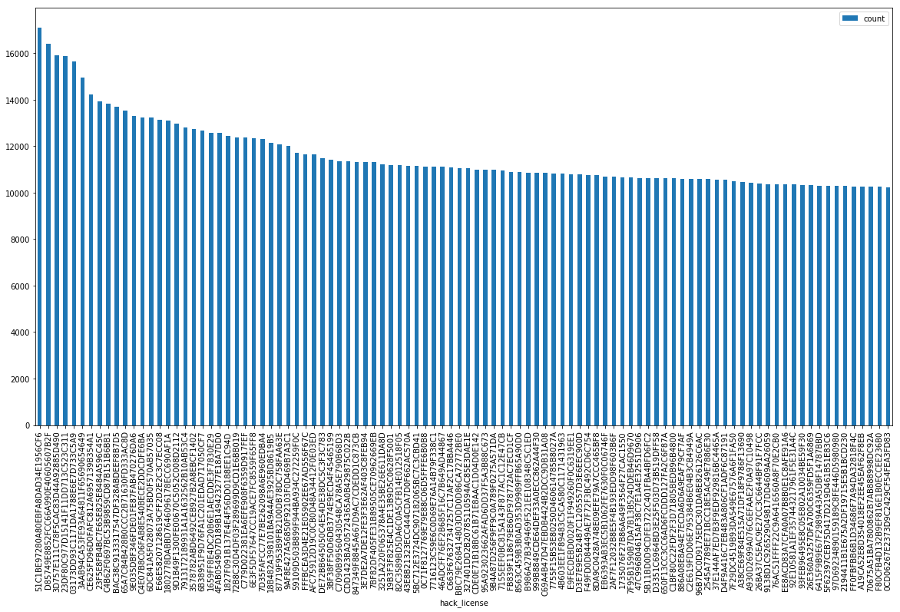

# YellowSpark

_Authors: Maxime Lovino, Marco Rodrigues Lopes, David Wittwer_

YellowSpark is a project for a Big Data Analytics class at HES-SO Master. The project is based on NYC 2013 Taxi data that can be found [here](http://www.andresmh.com/nyctaxitrips/). The goal of the project is to compute analytics and train machine learning models on the taxi rides in the dataset. The project will be written in Scala and will use Spark to compute the analytics.

We will also use boundaries for the NYC boroughs available [here](https://nycdatastables.s3.amazonaws.com/2013-08-19T18:15:35.172Z/nyc-borough-boundaries-polygon.geojson) as GeoJSON data.

## Dataset description

The dataset consists of New York City taxi rides data from the year 2013. It is separated by month. For each month, two files are available: the `trip_data` and the `trip_fare`. The two files contains the exact same rides but not the same set of columns. There are duplicated columns between the files that will use to join them. An explanation of the story behind the retrieval of this dataset can be found [here](https://chriswhong.com/open-data/foil_nyc_taxi/).

The `trip_data` file has the following structure and contains the information about the taxi physical movement, time and distance:

```
root
 |-- medallion: string (nullable = true)
 |-- hack_license: string (nullable = true)
 |-- rate_code: integer (nullable = true)
 |-- store_and_fwd_flag: string (nullable = true)
 |-- pickup_datetime: timestamp (nullable = true)
 |-- dropoff_datetime: timestamp (nullable = true)
 |-- passenger_count: integer (nullable = true)
 |-- trip_time_in_secs: integer (nullable = true)
 |-- trip_distance: double (nullable = true)
 |-- pickup_longitude: double (nullable = true)
 |-- pickup_latitude: double (nullable = true)
 |-- dropoff_longitude: double (nullable = true)
 |-- dropoff_latitude: double (nullable = true)
```

The `trip_fare` contains information about the cost and payment of the ride and has the following structure:

```
root
 |-- medallion: string (nullable = true)
 |-- hack_license: string (nullable = true)
 |-- vendor_id: string (nullable = true)
 |-- pickup_datetime: timestamp (nullable = true)
 |-- payment_type: string (nullable = true)
 |-- fare_amount: double (nullable = true)
 |-- surcharge: double (nullable = true)
 |-- mta_tax: double (nullable = true)
 |-- tip_amount: double (nullable = true)
 |-- tolls_amount: double (nullable = true)
 |-- total_amount: double (nullable = true)
```

In order to join the two datasets, we use the `medallion`, which is the identifier of the taxi car, the `hack_license` which identifies the driver license and the `pickup_datetime`.

The joined dataset has the following structure:

```
root
 |-- medallion: string (nullable = true)
 |-- hack_license: string (nullable = true)
 |-- pickup_datetime: timestamp (nullable = true)
 |-- rate_code: integer (nullable = true)
 |-- store_and_fwd_flag: string (nullable = true)
 |-- dropoff_datetime: timestamp (nullable = true)
 |-- passenger_count: integer (nullable = true)
 |-- trip_time_in_secs: integer (nullable = true)
 |-- trip_distance: double (nullable = true)
 |-- pickup_longitude: double (nullable = true)
 |-- pickup_latitude: double (nullable = true)
 |-- dropoff_longitude: double (nullable = true)
 |-- dropoff_latitude: double (nullable = true)
 |-- vendor_id: string (nullable = true)
 |-- payment_type: string (nullable = true)
 |-- fare_amount: double (nullable = true)
 |-- surcharge: double (nullable = true)
 |-- mta_tax: double (nullable = true)
 |-- tip_amount: double (nullable = true)
 |-- tolls_amount: double (nullable = true)
 |-- total_amount: double (nullable = true)
```

At first, in order to avoid overloading our computers while still exploring and analysing the dataset, we have only worked on the January data and haven't opened the other files.

The January dataset contains 14'776'615 total rides before any cleaning or filtering, and weighs 2.46GB for the `trip_data` and 1.68GB for the `trip_fare`. 

We then uploaded the 24 files in a AWS S3 bucket in order to run the processing on the whole year on AWS EC2. The total size of the whole uncompressed dataset was more or less 50GB.

## Features used and pre-processing

We added some calculated features to our dataset as well. First of all, we don't like ["retard units"](https://en.wikipedia.org/wiki/Imperial_units) so we added a `trip_distance_km` column to have the distance converted to kilometers. Then, we added the `average_speed_kmh` computed from `trip_time_in_secs` and `trip_distance_km`. The speed will used for one of our analysis as well as for filtering out bad data.

Then, we used the boroughs boundaries we had at our disposal and the pickup/dropoff longitude/latitude of the dataset to add `pickup_borough` and `dropoff_borough`. These two columns will also be used for filtering out bad data and one of our analysis.

Finally, for the fares part, we added `taxi_revenue` which is the sum of the fare and the tip for a ride and as such it computes the amount that goes in the driver's pocket for the ride.

Finally, we also added the `great_circle_distance_km` column that contains the [distance of the straight path](https://en.wikipedia.org/wiki/Great-circle_distance) between the pickup and dropoff locations. This will be used for filtering out bad data.

The final structure is the following:

```
root
 |-- medallion: string (nullable = true)
 |-- hack_license: string (nullable = true)
 |-- pickup_datetime: timestamp (nullable = true)
 |-- rate_code: integer (nullable = true)
 |-- store_and_fwd_flag: string (nullable = true)
 |-- dropoff_datetime: timestamp (nullable = true)
 |-- passenger_count: integer (nullable = true)
 |-- trip_time_in_secs: integer (nullable = true)
 |-- trip_distance: double (nullable = true)
 |-- pickup_longitude: double (nullable = true)
 |-- pickup_latitude: double (nullable = true)
 |-- dropoff_longitude: double (nullable = true)
 |-- dropoff_latitude: double (nullable = true)
 |-- trip_distance_km: double (nullable = true)
 |-- average_speed_kmh: double (nullable = true)
 |-- pickup_borough: string (nullable = true)
 |-- dropoff_borough: string (nullable = true)
 |-- great_circle_distance_km: double (nullable = true)
 |-- vendor_id: string (nullable = true)
 |-- payment_type: string (nullable = true)
 |-- fare_amount: double (nullable = true)
 |-- surcharge: double (nullable = true)
 |-- mta_tax: double (nullable = true)
 |-- tip_amount: double (nullable = true)
 |-- tolls_amount: double (nullable = true)
 |-- total_amount: double (nullable = true)
 |-- taxi_revenue: double (nullable = true)
```

### Data cleaning

First of all, we decided to drop any ride using the rate code #05, because as stated [here](https://www1.nyc.gov/site/tlc/passengers/taxi-fare.page) and as seen in our dataset, the rides with rate code #05 are _Out of City Negotiated Flat Rate_ and in the dataset do not contain any information about duration, distance or locations, so we can't do anything with these rides.

Then, we noticed many "failed" rides with duration smaller or equal to 1 second, distance of 0.0 km, etc. We used the average speed we computed to filter out any ride with an average speed of more than 120 km/h (we could actually go further down with this limit).

There were also some failed coordinates for rides and we decided to remove them as well, basically we used the pickup and dropoff boroughs and filtered out all rides which had started or ended outside of any borough boundaries.

We also removed any rides with 0 passengers and rides with `fare_amount <= 0` because they make no sense.

Finally, we used the `great_circle_distance_km` column we computed to remove all rate code #01 rides (most of the rides have rate code #01 and our trafic congestion model uses only those rides) to remove any  ride that had a distance smaller than the `great_circle_distance_km` with a margin of 0.5 km.

In the end, our full year dataset with the data cleaning applied contains 165'649'140 rides. The final cleaned dataset is saved as Parquet on S3 to be later used by our other programs (more on that later).

## Analysis questions

### Data analysis

All our data analysis is done with our `YellowSparkAnalysis` program. This program will run all the analysis listed below and save the results as Parquet dataframes on S3. These dataframes are later opened in Jupyter Notebook with PySpark in order to plot the visualisations. We could have used Zeppelin to plot the visualisations but we find it very incomplete and the plots are only interactive which causes a problem when we restart the notebook kernels because we need to reselect the columns of the plots.

#### Rate codes analysis

As introduced before, the [NYC taxi fare system](https://www1.nyc.gov/site/tlc/passengers/taxi-fare.page) has a number of rate codes to denote the type of ride and the calculation of its fare. The most notables are:

- **Rate code 1**: Standard City Rate (most rides)
- **Rate code 2**: Trips between Manhattan and JFK airport
- **Rate code 3**: Trips between Manhattan and Newark airport

In the plot below, we display the plot of the number of rides per rate code, we used a logarithmic scale for the Y axis because mos trips are in rate code 1 and the other rate codes would be invisible with a linear scale.


The data is the following:

| rate_code | count     |
| --------- | --------- |
| 0         | 25540     |
| 1         | 162642242 |
| 2         | 2886818   |
| 3         | 20635     |
| 4         | 72013     |
| 6         | 1683      |
| 7         | 28        |
| 8         | 4         |
| 9         | 13        |
| 10        | 1         |
| 15        | 1         |
| 17        | 1         |
| 28        | 6         |
| 65        | 5         |
| 77        | 1         |
| 79        | 2         |
| 200       | 1         |
| 206       | 1         |
| 210       | 144       |
| 221       | 1         |

#### Boroughs analysis

We ran the analysis by the borough of the pickup, dropoff and then by the pickup-dropoff pairs of boroughs.

##### Pickup boroughs

##### Dropoff boroughs

##### Pairs of boroughs

##### Wait times by last borough

#### Dates and time analysis

##### Number of rides

##### Average tip amount

##### Average revenue

##### Average trip duration

##### Average distance

#### Top drivers

We found 42750 unique drivers in the dataset (unique hack licenses).

##### Most revenue


| hack_license                     | total_revenue |
| -------------------------------- | ------------- |
| 1EDF99EE9DAC182027330EF48828B54A | 232833.64     |
| D85749E8852FCC66A990E40605607B2F | 217306.57     |
| 3AAB94CA53FE93A64811F65690654649 | 203246.73     |
| 51C1BE97280A80EBFA8DAD34E1956CF6 | 198731.73     |
| 23DF80C977D15141F11DD713C523C311 | 193650.41     |
| 3D757E111C78F5CAC83D44A92885D490 | 191687.20     |
| C4B62F0697BC53B9859CD87B151B6BB1 | 186191.71     |
| 23F5E8FB4BC7E65E825E8484A596C45C | 180852.82     |
| AFC75912D19C0CB0D48A34412F0E03ED | 179400.75     |
| 03173DD93C1171DA1788E6E7D733C5A9 | 178889.01     |
| 6DC841A5F028073A75BD0F570AB57035 | 177695.73     |
| C4E07B8C06FAB8E540BECE2DDCDFE6BA | 175640.29     |
| CE625FD96D0FAFC812A6957139B354A1 | 170847.82     |
| 65A7C84B428B0CCC2B71630FD333AC8D | 169315.45     |
| 3251A220F065378A4E35BE26E611DA8D | 167144.60     |
| C779D022381EA6EFE908F6359D917FEF | 166976.32     |
| 9D1B49F1300FE00670C5052C008D2112 | 166937.46     |
| E66E58207128619CFF2D2E2C3C7ECC08 | 164550.29     |
| 7716123C59E6C0D69E76A14B79F338C1 | 161080.20     |
| 7913172189931A1A1632562B10AB53C4 | 160795.84     |

##### Most tips



| hack_license                     | total_tips |
| -------------------------------- | ---------- |
| D85749E8852FCC66A990E40605607B2F | 20951.57   |
| 51C1BE97280A80EBFA8DAD34E1956CF6 | 20562.23   |
| 3AAB94CA53FE93A64811F65690654649 | 20341.73   |
| AFC75912D19C0CB0D48A34412F0E03ED | 19090.75   |
| 23DF80C977D15141F11DD713C523C311 | 18408.41   |
| 23F5E8FB4BC7E65E825E8484A596C45C | 17963.82   |
| C4E07B8C06FAB8E540BECE2DDCDFE6BA | 17950.29   |
| C4B62F0697BC53B9859CD87B151B6BB1 | 17876.11   |
| 3D757E111C78F5CAC83D44A92885D490 | 17715.70   |
| 65A7C84B428B0CCC2B71630FD333AC8D | 17489.97   |
| 6DC841A5F028073A75BD0F570AB57035 | 16947.73   |
| 3251A220F065378A4E35BE26E611DA8D | 16692.10   |
| CE625FD96D0FAFC812A6957139B354A1 | 16171.82   |
| 9D1B49F1300FE00670C5052C008D2112 | 16126.96   |
| 7716123C59E6C0D69E76A14B79F338C1 | 16002.70   |
| 92E10581A1EF357443217961F5E31A4C | 15990.62   |
| CDE0E71B18BC61B71E8AAC1D04D0E142 | 15900.56   |
| 6C2FF19A115CC50926F2A6CFC9494A90 | 15849.58   |
| 7913172189931A1A1632562B10AB53C4 | 15808.84   |
| C779D022381EA6EFE908F6359D917FEF | 15693.82   |

##### Most distance


| hack_license                     | total_distance_km |
| -------------------------------- | ----------------- |
| D85749E8852FCC66A990E40605607B2F | 76392.102840      |
| 3AAB94CA53FE93A64811F65690654649 | 69162.834906      |
| 8C1D318CCC75B91ACBFC789715922449 | 67259.307554      |
| 51C1BE97280A80EBFA8DAD34E1956CF6 | 65834.848533      |
| AFC75912D19C0CB0D48A34412F0E03ED | 65127.897658      |
| 23DF80C977D15141F11DD713C523C311 | 62359.832858      |
| 23F5E8FB4BC7E65E825E8484A596C45C | 62332.055650      |
| 6C2FF19A115CC50926F2A6CFC9494A90 | 62319.534984      |
| 6DC841A5F028073A75BD0F570AB57035 | 62190.787784      |
| C4B62F0697BC53B9859CD87B151B6BB1 | 62084.474784      |
| 970978A9CF1C59F8DC462176E305EFCD | 62042.519290      |
| 3251A220F065378A4E35BE26E611DA8D | 61513.464859      |
| 3D757E111C78F5CAC83D44A92885D490 | 61237.961944      |
| 5114DF85775775ED4F53235D8478E80B | 60927.954780      |
| 9D1B49F1300FE00670C5052C008D2112 | 60924.092364      |
| C4E07B8C06FAB8E540BECE2DDCDFE6BA | 59159.499334      |
| C779D022381EA6EFE908F6359D917FEF | 58413.248376      |
| 5305DE3681B59EC2CD720C3DD8CBFFBC | 57366.469266      |
| E66E58207128619CFF2D2E2C3C7ECC08 | 56977.234294      |
| 1E94B13BB698BC3C98178429C45FDEED | 56808.253594      |

##### Most rides



| hack_license                     | count |
| -------------------------------- | ----- |
| 51C1BE97280A80EBFA8DAD34E1956CF6 | 17119 |
| D85749E8852FCC66A990E40605607B2F | 16454 |
| 3D757E111C78F5CAC83D44A92885D490 | 15950 |
| 23DF80C977D15141F11DD713C523C311 | 15946 |
| 03173DD93C1171DA1788E6E7D733C5A9 | 15720 |
| 3AAB94CA53FE93A64811F65690654649 | 15033 |
| CE625FD96D0FAFC812A6957139B354A1 | 14298 |
| 23F5E8FB4BC7E65E825E8484A596C45C | 13953 |
| C4B62F0697BC53B9859CD87B151B6BB1 | 13859 |
| BAC38C9133317547DF328ABDEEF8B7D5 | 13781 |
| 65A7C84B428B0CCC2B71630FD333AC8D | 13575 |
| 9E035DBF346FDE01FE87FAB470276DA6 | 13314 |
| C4E07B8C06FAB8E540BECE2DDCDFE6BA | 13309 |
| 6DC841A5F028073A75BD0F570AB57035 | 13259 |
| E66E58207128619CFF2D2E2C3C7ECC08 | 13162 |
| 1802778DABBD7646096178ECC690AF1A | 13125 |
| 9D1B49F1300FE00670C5052C008D2112 | 12991 |
| 7913172189931A1A1632562B10AB53C4 | 12837 |
| 3578782ABD6492CEB927B2A8EBCF1402 | 12745 |
| 6B38951F9D76FA1C201EDAD717050CF7 | 12704 |

##### Most trip duration


| hack_license                     | total_duration |
| -------------------------------- | -------------- |
| 624F08173354FF95805B7B6C9318186D | 127661229      |
| 255243D75757CA69E2270A525DABEFDB | 107419820      |
| 6CEE2CD9DCF76C53512579DF719D2B57 | 92906387       |
| F426171D9725BF58B391BA8BEC3919F0 | 86008631       |
| EA52BEEB093A7B711A366ECF525D621A | 72746400       |
| A33DB5A909ADBFCE2AB057264141C8E9 | 61314328       |
| 8DE35D615C7F0AE944C288BB13479AE5 | 60226484       |
| BA4527CF0724B3C024C9132265B6D07B | 60105814       |
| C82BB3EA982A6865F938C0D1CD617C45 | 59120500       |
| BEC578DC2483869BA7166498CF14A6B7 | 57997689       |
| D605BB43ABD8208CB08D0E36BDFD393E | 55939541       |
| 4A3B64EFD0FE0508C9DD537CF527771E | 55417935       |
| 9199D1A612020B20CFE1F6DA7C70021A | 54025498       |
| 2BC91399E0D73A883FA6869740EC633D | 53864653       |
| 51A03E200C82F7CA6A7273D7686103F5 | 53735470       |
| D3B2DEC5DB78D91D9AFADA53B3B521B5 | 52921779       |
| 0420EC44A00B1764DADD034981FC24D3 | 51048364       |
| 6E15DFCAF6B5C3FE041D97BBF4587742 | 50205294       |
| ED0014C5C4E7EA18A5F92F5C2359E1CD | 50086096       |
| DB646BA4F0DFB060FAF3879A33EAE3FB | 49287599       |

#### Top medallions (taxi cars)

##### Most distance

##### Most rides

##### Most passengers

##### Most trip duration

#### Distances analysis

#### Speeds analysis

#### Costs analysis

### Machine Learning

#### Linear regression model for fare calculation

#### Regression model for trip duration prediction

## Algorithms

#### Borough detection UDF

#### Feature extraction for training trip duration model

## Optimisations

TODO talk about using Parquet

## Testing and evaluation

TODO talk about train test split

## Future improvements

TODO talk about better models and data for traffic prediction, multiyear data as well